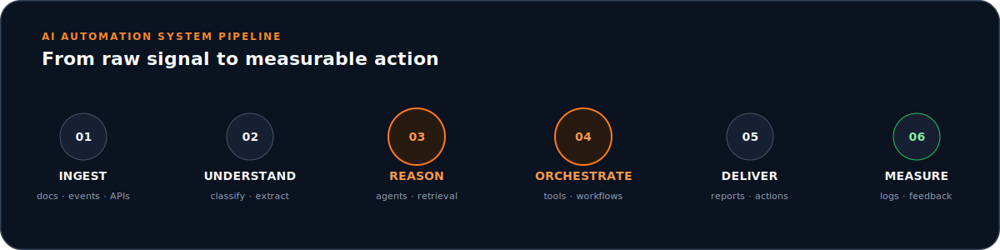
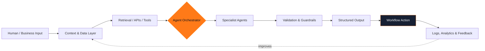
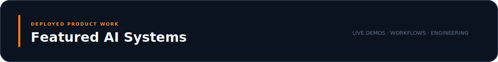
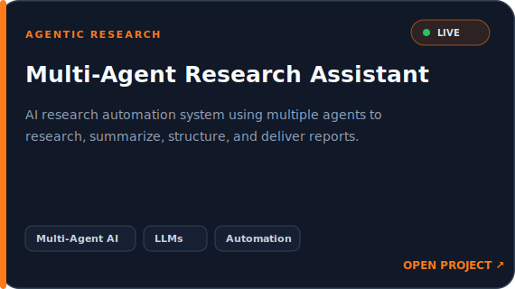
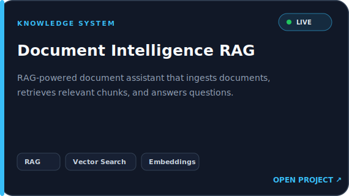
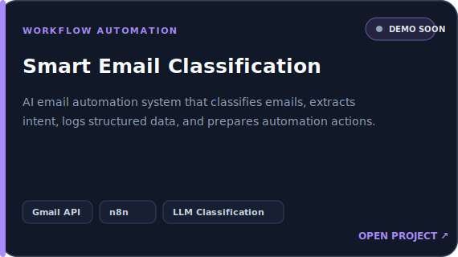
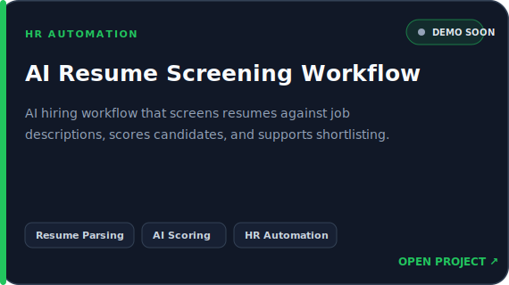
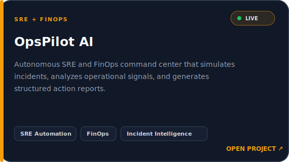

<div align="center">


<br/>

<table>
<tr>
<td width="28%" align="center" valign="middle">

</td>
<td width="72%" valign="middle">

## Building AI systems that move work forward.

[](https://git.io/typing-svg)

I design practical AI products that can **reason over context, coordinate workflows, retrieve knowledge, and produce useful actions** — from multi-agent research to document intelligence and operations automation.

[](https://kovi-ai-automation-portfolio.vercel.app/)
[](https://www.linkedin.com/in/kovi-varun-jaswanth-sai-588599302/)
[](mailto:sjaswanth486@gmail.com)
[](https://github.com/starker111)

</td>
</tr>
</table>

</div>


## Mission control

<table>
<tr>
<td width="58%" valign="top">

### About me

I am a B.Tech Artificial Intelligence and Data Science student focused on shipping **deployed, recruiter-ready AI products**. My work sits at the intersection of LLM applications, agentic systems, retrieval, workflow automation, and useful product engineering.

I care about the full path from an idea to a working system: structuring the problem, orchestrating models and tools, building the interface, deploying it, and making the output understandable.

</td>
<td width="42%" valign="top">

### Current positioning

```yaml
role: AI Automation Engineer
focus: Agentic AI + RAG + LLM Apps
building: Production-minded AI workflows
delivery: Deployed demos and clear UX
mode: Learning fast, shipping faster
```

</td>
</tr>
</table>

<br/>


## System architecture




## Engineering toolkit

<div align="center">

[](https://skillicons.dev)

</div>

| AI + LLM Systems | Automation + APIs | Data + Analytics |
|:---|:---|:---|
|       |      |       |

<br/>


<table>
<tr>
<td width="50%" valign="top"><a href="https://multi-agent-research-automation.vercel.app/"></a><br/><a href="https://multi-agent-research-automation.vercel.app/"></a></td>
<td width="50%" valign="top"><a href="https://document-intelligence-rag-iota.vercel.app/"></a><br/><a href="https://document-intelligence-rag-iota.vercel.app/"></a></td>
</tr>
<tr>
<td width="50%" valign="top"><a href="https://kovi-ai-automation-portfolio.vercel.app/"></a><br/></td>
<td width="50%" valign="top"><a href="https://kovi-ai-automation-portfolio.vercel.app/"></a><br/></td>
</tr>
<tr>
<td width="50%" valign="top"><a href="https://opspilot-ai-coral.vercel.app/"></a><br/><a href="https://opspilot-ai-coral.vercel.app/"></a> <a href="https://github.com/starker111/opspilot-ai"></a></td>
<td width="50%" valign="top"></td>
</tr>
</table>

> **Product signal:** 3 deployed demos are live now. The two workflow projects marked **Deployment Link Pending** are real projects whose public URLs still need to be added — no invented demos or claims.


## GitHub engineering telemetry

<div align="center">

<picture>
  <source media="(prefers-color-scheme: dark)" srcset="https://github-readme-stats.vercel.app/api?username=starker111&show_icons=true&hide_border=true&bg_color=0d1117&title_color=ff7a18&icon_color=ff7a18&text_color=c9d1d9&rank_icon=github" />
  
</picture>
<picture>
  <source media="(prefers-color-scheme: dark)" srcset="https://streak-stats.demolab.com?user=starker111&hide_border=true&background=0D1117&ring=FF7A18&fire=FF7A18&currStreakLabel=FF7A18&sideLabels=C9D1D9&dates=8B949E&currStreakNum=F8FAFC&sideNums=F8FAFC" />
  
</picture>

<br/>

<picture>
  <source media="(prefers-color-scheme: dark)" srcset="https://github-readme-stats.vercel.app/api/top-langs/?username=starker111&layout=compact&hide_border=true&bg_color=0d1117&title_color=ff7a18&text_color=c9d1d9&langs_count=8" />
  
</picture>

<br/><br/>


<br/>


</div>


<table>
<tr>
<td width="50%" valign="top">

## Learning direction

- Evaluating and observing multi-agent systems
- Production RAG: retrieval quality, reranking, and citations
- Reliable tool use and structured LLM outputs
- Human-in-the-loop workflow design
- AI product deployment and operational feedback

</td>
<td width="50%" valign="top">

## Building next

- Reusable agent orchestration patterns
- More measurable automation case studies
- Workflow dashboards with audit trails
- AI systems that connect reasoning to real APIs
- Public technical breakdowns of shipped projects

</td>
</tr>
</table>

## Let's build something useful

I am open to **AI engineering internships, automation projects, applied LLM work, and conversations with teams building practical AI products**.

<div align="center">

[](https://kovi-ai-automation-portfolio.vercel.app/)
[](https://www.linkedin.com/in/kovi-varun-jaswanth-sai-588599302/)
[](mailto:sjaswanth486@gmail.com)

<br/><br/>


<sub>Designed as an AI Automation Command Center · Data-driven and refreshed with GitHub Actions</sub>

</div>
