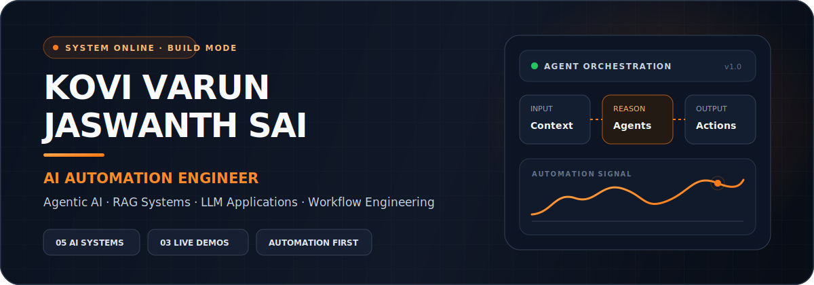
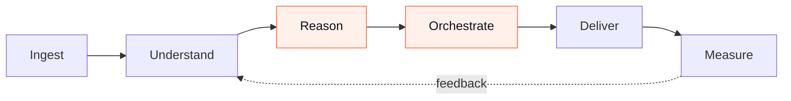
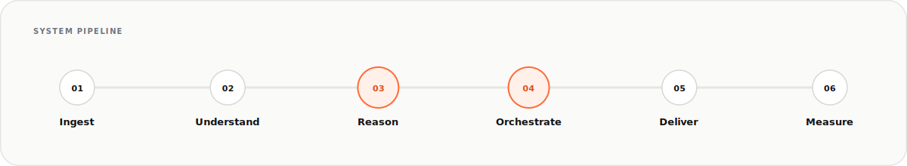
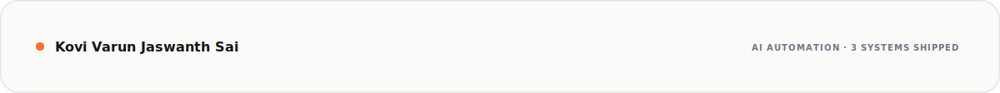

<div align="center">



<br/>

<table>
<tr>
<td width="25%" align="center" valign="middle">

</td>
<td width="75%" valign="middle">

## Practical AI systems, designed to ship.

[](https://git.io/typing-svg)

I build AI products that connect models with context, tools, and real workflows. My current work spans multi-agent research, document intelligence, operational automation, and applied LLM interfaces.

</td>
</tr>
</table>

<table>
<tr>
<td align="center"><a href="https://kovi-ai-automation-portfolio.vercel.app/"></a></td>
<td align="center"><a href="https://www.linkedin.com/in/kovi-varun-jaswanth-sai-588599302/"></a></td>
<td align="center"><a href="mailto:sjaswanth486@gmail.com"></a></td>
<td align="center"><a href="https://github.com/starker111"></a></td>
</tr>
</table>

</div>

## About me

I am a B.Tech Artificial Intelligence and Data Science student focused on building practical, deployed AI systems. I enjoy the engineering between a promising model and a product someone can actually use.

My work covers problem framing, retrieval and agent orchestration, workflow integration, interface development, deployment, and clear output design.

### Current positioning

```text
ROLE:     AI Automation Engineer
FOCUS:    Agentic AI · RAG · LLM applications
BUILDING: Reliable workflows connected to real tools
MODE:     Learn, measure, ship
```

## System pipeline



<details>
<summary>Static pipeline fallback</summary>
<br/>

</details>

## Tech stack

<div align="center">

[](https://skillicons.dev)

</div>

**AI + LLM**

     

**Automation + APIs**

    

**Data + analytics**

     

## Featured AI systems

### Shipped & live

<table>
<tr>
<td width="50%" valign="top">
<h3>Multi-Agent Research Assistant</h3>
<p><code>AGENTIC RESEARCH</code> &nbsp; <strong>● LIVE</strong></p>
<p>A multi-agent research system that gathers evidence, synthesizes findings, structures the result, and delivers a usable report.</p>
<p><code>Multi-Agent AI</code> · <code>LLMs</code> · <code>Automation</code> · <code>Report Generation</code></p>
<p><a href="https://multi-agent-research-automation.vercel.app/"></a></p>
</td>
<td width="50%" valign="top">
<h3>Document Intelligence RAG</h3>
<p><code>KNOWLEDGE SYSTEM</code> &nbsp; <strong>● LIVE</strong></p>
<p>A document assistant that ingests files, retrieves relevant chunks, and answers questions using grounded context.</p>
<p><code>RAG</code> · <code>Vector Search</code> · <code>Embeddings</code> · <code>Document AI</code></p>
<p><a href="https://document-intelligence-rag-iota.vercel.app/"></a></p>
</td>
</tr>
<tr>
<td width="50%" valign="top">
<h3>OpsPilot AI</h3>
<p><code>SRE + FINOPS</code> &nbsp; <strong>● LIVE</strong></p>
<p>An autonomous SRE and FinOps command center for incident simulation, signal analysis, and structured action reports.</p>
<p><code>SRE Automation</code> · <code>FinOps</code> · <code>Incident Intelligence</code> · <code>Next.js</code></p>
<p><a href="https://opspilot-ai-coral.vercel.app/"></a> <a href="https://github.com/starker111/opspilot-ai"></a></p>
</td>
<td width="50%"></td>
</tr>
</table>

### In development

These workflows are actively being built and do not have public deployment URLs yet.

<table>
<tr>
<td width="50%" valign="top">
<h4>Smart Email Classification</h4>
<p><code>IN DEVELOPMENT</code></p>
<p>An email workflow that classifies messages, extracts intent, records structured data, and prepares downstream actions.</p>
<p><code>Gmail API</code> · <code>n8n</code> · <code>LLM Classification</code> · <code>Workflow Automation</code></p>
</td>
<td width="50%" valign="top">
<h4>AI Resume Screening Workflow</h4>
<p><code>IN DEVELOPMENT</code></p>
<p>A hiring workflow for parsing resumes, comparing them with job requirements, scoring candidates, and supporting shortlisting.</p>
<p><code>Resume Parsing</code> · <code>AI Scoring</code> · <code>HR Automation</code> · <code>Candidate Ranking</code></p>
</td>
</tr>
</table>

> 3 systems are currently deployed. Projects without public URLs are deliberately labeled **In Development**.

## GitHub activity

Static fallback: [view repositories and contribution activity directly on GitHub](https://github.com/starker111?tab=repositories).

<div align="center">


<br/><br/>


<br/><br/>


</div>

<details>
<summary><strong>Expand for extended metrics</strong></summary>
<br/>
If the generated image is unavailable, the core profile and project links above remain fully usable.
<br/><br/>

</details>

## Contribution trail

<div align="center">


</div>

Snake fallback: [open the native GitHub contribution graph](https://github.com/starker111#js-contribution-activity).

<table>
<tr>
<td width="50%" valign="top">

### Learning direction

- Evaluating multi-agent reliability
- Retrieval quality, reranking, and citations
- Structured outputs and dependable tool use
- Human-in-the-loop workflow design

</td>
<td width="50%" valign="top">

### Building next

- Reusable agent orchestration patterns
- Measurable automation case studies
- Workflow dashboards with audit trails
- Technical breakdowns of shipped systems

</td>
</tr>
</table>

## Contact

Open to AI engineering internships, applied LLM work, and automation projects.

<p align="center">
<a href="https://kovi-ai-automation-portfolio.vercel.app/"></a>
<a href="https://www.linkedin.com/in/kovi-varun-jaswanth-sai-588599302/"></a>
<a href="mailto:sjaswanth486@gmail.com"></a>
</p>


